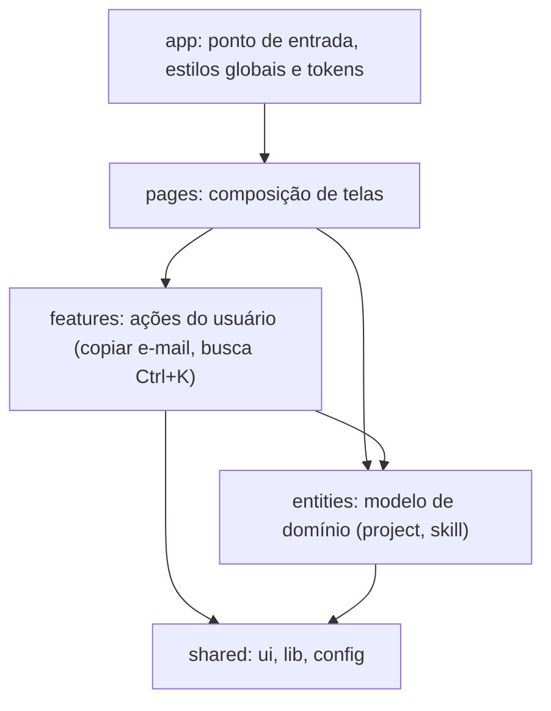

# Gabriel Berlofa | Portfólio de Engenharia de Software

Site pessoal que reúne meus projetos, competências e estudos de caso de arquitetura N-Tier, engenharia de dados e agentes de IA. É também meu laboratório de front-end: a stack nova (React, TypeScript, Tailwind, Motion) com o mesmo rigor que uso no back-end.

**Site no ar:** https://gabriel-nux.github.io

> O código-fonte completo é privado. Aqui ficam o resultado, a arquitetura e **trechos escolhidos** (em [`amostras/`](amostras)). Se quiser ver mais, é só pedir: berlofaspike@gmail.com.

## Stack

React 19, TypeScript estrito, Tailwind v4, Vite, Motion (animações com física de mola), Zod, Radix e cmdk. Testes com Vitest e Testing Library. CI no GitHub Actions e Dependabot.

## Arquitetura

O código segue o [Feature-Sliced Design](https://feature-sliced.design): camadas com uma regra única de dependência, em que **cada camada só importa das de baixo**. A regra é verificada automaticamente pelo [Steiger](https://github.com/feature-sliced/steiger) no CI, então não depende de disciplina na revisão.

## Decisões de engenharia

| Tema | Decisão | Motivo |
|---|---|---|
| Tipagem | TypeScript estrito, com `noUncheckedIndexedAccess` | acesso a índice e dado ausente viram erro de compilação |
| Dados | Zod valida projetos e competências na carga do módulo | dado inválido derruba o build, não a tela |
| Estilo | Tailwind v4 com tokens em `@theme`; variantes com `cva` | uma fonte de verdade para cor e tipografia |
| Animação | Motion com molas, não curvas de tempo fixas | a velocidade é preservada ao interromper, o que dá sensação de peso |
| Acessibilidade | Radix e Sonner no lugar de componentes feitos à mão | foco, teclado e ARIA corretos sem reinventar |
| Qualidade | Vitest, ESLint, Prettier, `tsc` e auditoria de dependências no CI | nenhum merge sem tudo verde |

### Física das animações

Cada movimento usa uma mola amortecida cujo regime é escolhido pelo gesto. A razão de amortecimento é `ζ = c / (2·√(k·m))`: abaixo de 1 a mola balança, em 1 é crítica e acima de 1 fica pastosa. Cada configuração tem um teste que garante o regime pretendido. → [`molas.ts`](amostras/molas.ts) e [`molas.test.ts`](amostras/molas.test.ts)

| Movimento | `stiffness / damping / mass` | ζ | Regime e motivo |
|---|---|---|---|
| Botão magnético | 170 / 8 / 0,2 | ≈ 0,69 | subamortecida: leve balanço ao soltar |
| Elevação das camadas da pilha | 260 / 18 / 1 | ≈ 0,56 | subamortecida: o "pulinho" ao passar o cursor |
| Entrada dos chips de competência | 420 / 24 / 1 | ≈ 0,59 | subamortecida: "pula" e assenta |
| Inclinação das capturas de tela | 220 / 26 / 0,6 | ≈ 1,13 | quase crítica: acompanha o cursor sem oscilar |
| Parallax da pilha | 70 / 20 / 1 | ≈ 1,19 | sobreamortecida: movimento ambiente, calmo |
| Holofote que segue o cursor | 60 / 28 / 1 | ≈ 1,81 | sobreamortecida: nunca balança |

O cursor alimenta `MotionValue`s, que atualizam o estilo direto no DOM, fora do ciclo de renderização do React. Com `prefers-reduced-motion`, os deslocamentos são desligados.

### Outros trechos

- **Demo de aprovação humana** como máquina de estados pequena e testada → [`aprovacao.ts`](amostras/aprovacao.ts)
- **Dados validados no build** → [`schema-projeto.ts`](amostras/schema-projeto.ts)
- **Pré-renderização no build**, com CSS embutido na página → [`prerender.mjs`](amostras/prerender.mjs)

### Desempenho e acessibilidade

O HTML da primeira tela é pré-renderizado no build e o CSS vai embutido, então o navegador desenha o conteúdo antes de baixar o JavaScript. O React carrega na primeira interação (ou 900 ms depois do carregamento) e hidrata o HTML existente.

Lighthouse 13.5 na URL pública (2026-10-04; celular com 4G lento e CPU 4x mais lenta, desktop com perfil padrão):

| Categoria | Celular | Desktop |
|---|---|---|
| Desempenho | 99 | 99 |
| Acessibilidade | 100 | 100 |
| Boas práticas | 100 | 100 |
| SEO | 100 | 100 |

O `axe-core` não apontou violações, e a navegação por teclado (link "Pular para o conteúdo", Tab, setas nas abas, Ctrl+K, Esc) foi exercitada de ponta a ponta. Um leitor de tela real (NVDA, VoiceOver) ainda não foi usado.

### Segurança e dependências

- Links externos usam `rel="noopener noreferrer"`, coberto por teste.
- `npm audit --omit=dev` roda no CI e barra vulnerabilidade alta em produção. Hoje: 0.

## Projetos exibidos

- **Kuro NERV**: agentes de IA com aprovação humana ([estudo de caso](https://github.com/Gabriel-nux/kuro-agentic-workflow-case-study)).
- **Kuro SaaS**: sistema distribuído N-Tier com engine de IA local ([estudo de caso](https://github.com/Gabriel-nux/kuro-core-case-study)).
- **Forno & Código**: e-commerce full-stack ([demo](https://gabriel-nux.github.io/Forno-e-C-digo/), [vitrine](https://github.com/Gabriel-nux/Forno-e-C-digo)).

## Contato

berlofaspike@gmail.com · [LinkedIn](https://www.linkedin.com/in/gabriel-berlofa-b65a31431/) · [GitHub](https://github.com/Gabriel-nux)

Licença: todos os direitos reservados. Veja [`LICENSE`](LICENSE).
